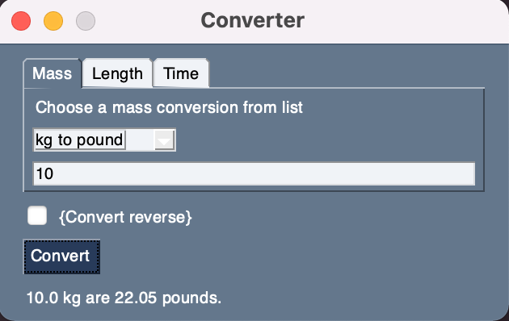
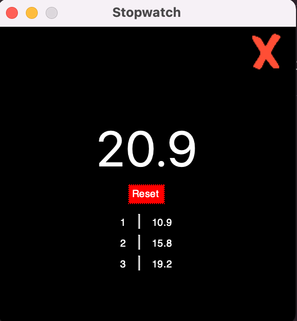
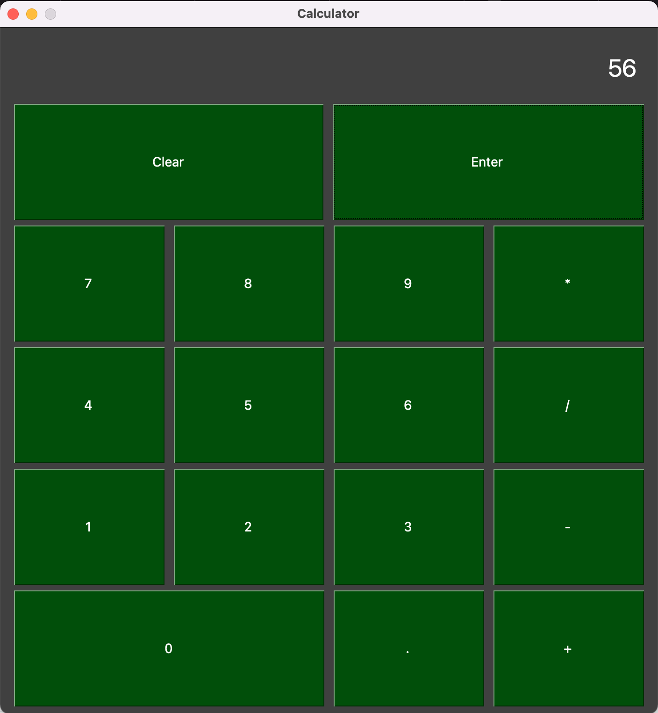
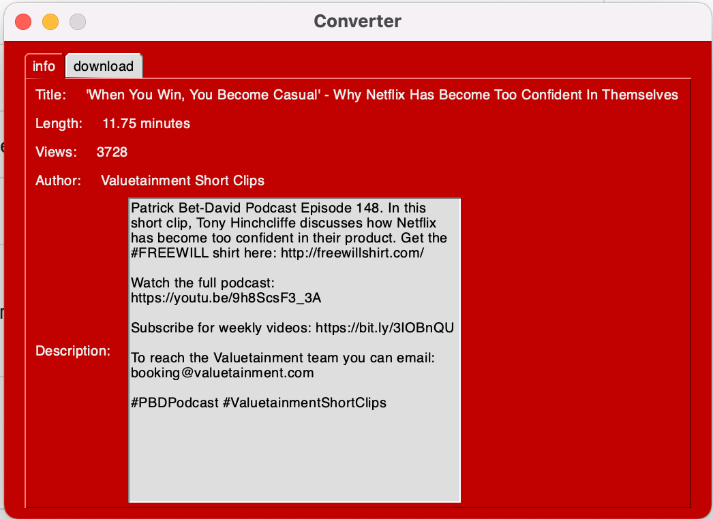
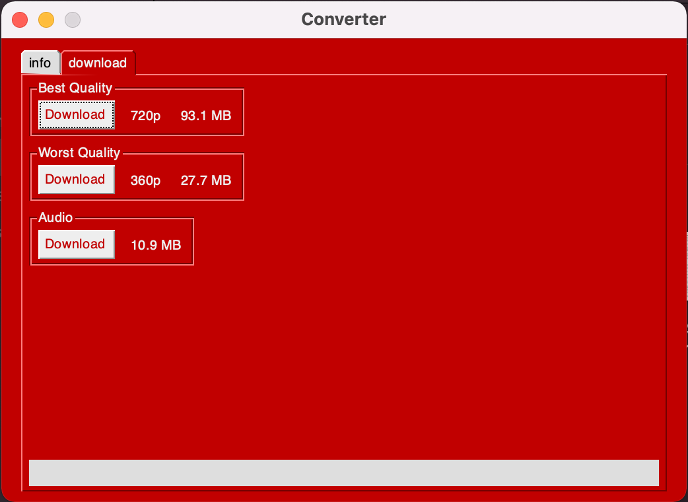

# One file Python GUI apps
Created to experiment with the PythonSimple GUI library. A collection of simple one file apps.

## App List
1. Unit Converter \
Converts 3 categories: Mass, Length and Time. Able to convert both ways (e.g kg to pounds and pounds to kg). Easily expandable to more units.
Screens: \

2. Stopwatch \
Able to lap, stop and reset. Potential errors with cross.png file, resave image if this occurs. 

3. Calculator \ 
Screens: \ 

4. YouTube audio/video downloader \
Allows to download a video from YouTube in best, worst quality and as an audio track. Potential error can come from the pytube library, specifically \
`pytube.exceptions.RegexMatchError: get_throttling_function_name: could not find match for multiple`. \
To avoid this you need to alter the pytube library file, as noted in [this SO issue](https://stackoverflow.com/questions/71883661/pytube-error-get-throttling-function-name-could-not-find-match-for-multiple)
Screens: \

## To test apps:
1. Clone repository
2. Install required libraries
`pip install -r requirements.txt`
3. Run any app via terminal
`python converter.py`